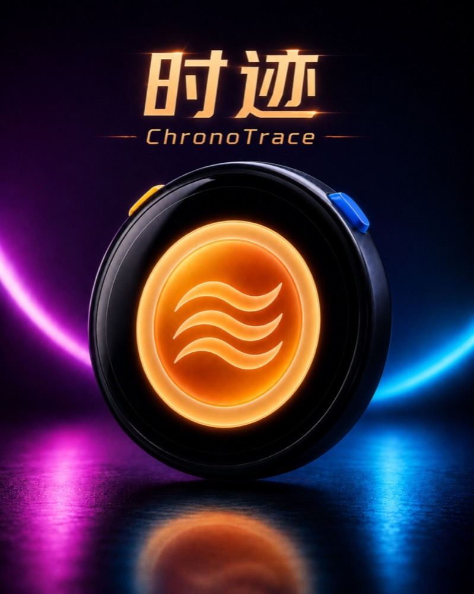
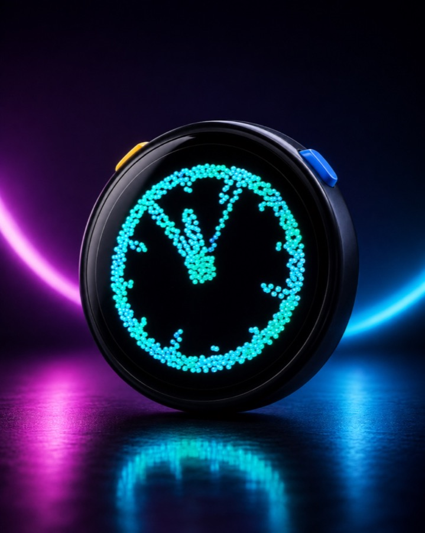

  
  <h1>时迹 ChronoTrace</h1>
  
<strong>当粒子开始流动，时间只是它的一种形状。</strong>

  
面向 M5Stack StopWatch 的独立粒子交互固件。 粒子会感受重力、触摸和声音，也会组成时间、图形与动画。

  

    <a href="#核心体验">核心体验</a> ·
    <a href="#安装">安装</a> ·
    <a href="#操作速查">操作速查</a> ·
    <a href="#联网与隐私">隐私</a> ·
    <a href="#授权与许可">授权与许可</a> ·
    <a href="README.md">English</a>
  

  

    
    
    
    
    
  

  
   概念展示图；设备上的粒子效果由固件实时渲染。

## 这不是一段预渲染动画

屏幕中的粒子实时参与物理计算。转动设备，它们会随重力流动；触摸屏幕，
它们会聚合、散落并重新组成可识别的形状；开启音乐律动后，低频、中频和
高频还会推动不同层次的粒子运动。

当前产品版本为 `1.0.0`。源码和已校验的发布文件以本仓库 GitHub Releases 页面为准；
M5Burner 页面或 Share Code 仅在开发者正式公布时有效。

## 核心体验

- **活的粒子流体：**粒子会响应设备姿态、触摸、碰撞和旋转，不是循环播放的视频。
- **粒子时间：**轻触组成当前时间，长按保持常显，并可切换数字钟和模拟钟。
- **粒子倒计时：**支持 1–60 分钟选择、暂停、继续和结束反馈。
- **图形与动画：**40 种内置图形、9 种粒子动画、随机切换和顺序循环播放。
- **自由自绘：**直接在圆屏上绘制并保存最多 12 个彩色图形，再由粒子重新演绎。
- **音乐律动：**外部音乐不只改变颜色，也会推动粒子池产生波动、喷跳与火花。
- **连接与信息：**支持设备端 Wi-Fi 配网、天气、Bluetooth 校时及中英文界面。
- **声音与触感：**程序化音效、音量、亮度和震动可在设备端调节。

  
  

## 兼容设备

<table align="center">
  <thead>
    <tr><th align="center">设备</th><th align="center">支持情况</th></tr>
  </thead>
  <tbody>
    <tr><td align="center"><strong>M5Stack StopWatch</strong></td><td align="center">唯一正式支持并进行真机测试的设备。</td></tr>
    <tr><td align="center">其他 ESP32-S3 设备</td><td align="center">不支持。屏幕、触摸、RTC、音频、PMIC 和 Flash 布局均不同。</td></tr>
  </tbody>
</table>

请确认设备确实是 M5Stack StopWatch。不要将本固件烧录到其他 ESP32-S3 产品。

## 安装

1. 从 M5Stack 官方渠道安装并打开 M5Burner。
2. 通过开发者正式公布的产品页或 Share Code 打开 ChronoTrace。
3. 确认目标设备为 **M5Stack StopWatch**，使用可传输数据的 USB 线连接。
4. 按 M5Burner 提示下载并烧录，中途不要断开 USB 或关闭电源。
5. 首次启动后，根据屏幕引导设置语言、声音、亮度及可选的连接功能。

> [!WARNING]
> 安装第三方固件会替换设备当前程序，并可能清除或改变原固件保存的数据。
> 安装前请确认自己有权操作该设备，并准备好 M5Stack 官方恢复方案。

ChronoTrace 当前不是通用 OTA 双分区固件。普通用户不应自行使用 `esptool.py`、
猜测写入地址或套用其他项目的分区参数；需要恢复时，请优先使用 M5Stack 官方
固件和官方说明。

需要从源码编译的开发者，请阅读[开发指南](docs/DEVELOPMENT.md)。

## 操作速查

需要完整说明时，请查看[《时迹使用指南》](docs/USER_GUIDE.zh-CN.md)。设备端也可在
“设置 → 使用指南”中查看按键、触控、图形和设置四页速查。

### 实体按键

<table align="center">
  <thead>
    <tr><th align="center">输入</th><th align="center">功能</th></tr>
  </thead>
  <tbody>
    <tr><td align="center">A 键短按</td><td align="center">打开或退出自绘编辑器。</td></tr>
    <tr><td align="center">A 键双击</td><td align="center">打开或关闭倒计时。</td></tr>
    <tr><td align="center">A 键长按</td><td align="center">切换粒子密度。</td></tr>
    <tr><td align="center">B 键短按</td><td align="center">切换粒子主题。</td></tr>
    <tr><td align="center">B 键双击</td><td align="center">查看电量与充电状态。</td></tr>
    <tr><td align="center">B 键长按</td><td align="center">开启或关闭音乐律动。</td></tr>
    <tr><td align="center">A + B 同时长按</td><td align="center">打开或关闭设置。</td></tr>
  </tbody>
</table>

### 默认界面手势

<table align="center">
  <thead>
    <tr><th align="center">手势</th><th align="center">功能</th></tr>
  </thead>
  <tbody>
    <tr><td align="center">点击</td><td align="center">粒子组成当前时间。</td></tr>
    <tr><td align="center">长按</td><td align="center">保持或释放常显粒子时钟。</td></tr>
    <tr><td align="center">双击</td><td align="center">时钟显示时切换数字/模拟钟；其他时候显示随机图形。</td></tr>
    <tr><td align="center">向左滑</td><td align="center">打开天气。</td></tr>
    <tr><td align="center">向右滑</td><td align="center">进入图形模式。</td></tr>
    <tr><td align="center">向上 / 向下滑</td><td align="center">提高 / 降低音量。</td></tr>
  </tbody>
</table>

## 联网与隐私

- 不需要注册账号，也不包含广告或行为统计模块。
- Wi-Fi 名称和密码由用户在设备上输入，并保存在设备本地 NVS。
- 配网页面按设计以明文显示 Wi-Fi 密码，请只在私密环境中使用。
- 自动天气会通过 `ipwho.is` 使用公网 IP 获取近似城市和经纬度；手动城市模式会发送用户输入的城市名称。
- 天气查询会将经纬度发送给 Open-Meteo，以获取当前天气和当日温度范围。
- 自绘图形、麦克风音频和播放内容不会上传；麦克风数据仅在设备本地用于音乐律动。
- Bluetooth 仅用于时间校准，不传输自绘图形或麦克风音频。
- 关闭 Wi-Fi 会停止天气网络请求；如需清除本地数据，应使用厂商说明的擦除与恢复流程。

完整说明见[隐私说明](docs/PRIVACY.zh-CN.md)。第三方服务还受其各自隐私政策约束。

## 当前限制

- 仅支持 2.4 GHz Wi-Fi，不支持只开启 5 GHz 的网络。
- 自动城市来自公网 IP 推断，只能提供近似位置，不是 GPS 定位。
- 天气和音乐律动效果会受到网络、路由器、环境声音和麦克风距离影响。
- 本版本不提供通用 OTA 更新；后续升级请遵循正式发布说明。
- 当前通用 M5Burner 固件不等于防复制或防逆向产品，请只从正式渠道获取。

## 数据清除与恢复

- 关闭 Wi-Fi 或 Bluetooth：进入设置中的连接页面。
- 删除自绘图形：进入图形选择器并使用删除操作。
- 完全移除 ChronoTrace：使用 M5Stack 官方 M5Burner 恢复对应设备的官方固件。
- 如需同时删除本地数据，请确认恢复流程会擦除 NVS；只重写应用不一定会清除 NVS。
- 恢复前如需保留原数据，请先按照设备厂商提供的方法完成备份。

## 支持与安全反馈

使用问题或兼容性问题请通过正式发布页或开发者公布的渠道反馈。安全问题请使用
GitHub 私密漏洞报告功能，并阅读 [SECURITY.md](SECURITY.md)。不要公开发布 Wi-Fi
凭据、设备备份、序列号或包含个人信息的日志。

## 授权与许可

ChronoTrace 由**个人开发者：小奥**开发。Copyright © 2026 Xiao Ao。

- ChronoTrace 原创源码和文档使用 [MIT License](LICENSE) 开源。
- FluidBox、字体及硬件组件继续遵守各自的 MIT、BSD-3-Clause、Apache-2.0 和 SIL OFL 许可证。
- “时迹 ChronoTrace”名称与 Logo 用于识别官方项目发布；MIT License 不授权冒充官方版本或虚假宣称背书。

第三方依赖及其许可见[第三方软件声明](THIRD_PARTY_NOTICES.md)。

ChronoTrace 是独立开发的第三方固件，与 M5Stack 不存在隶属、联合开发或官方背书关系。
